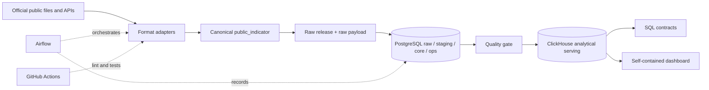

# Thai Public Data Platform

[English](README.md) · [ภาษาไทย](README_TH.md)

A portfolio-grade local data platform for public Thai finance and workforce
data. It is designed to show the engineering boundary that an AI Engineer also
needs when owning data products: reproducible ingestion, explicit grain,
lineage, data-quality gates, incremental loading, operational metadata and
analytical serving.

## What is implemented

The repository now contains two deliberately separate paths:

1. The original Excel path for source-specific workbook parsing, raw cell
   evidence, PostgreSQL `raw → staging → core`, ClickHouse serving and the
   eight-task Airflow DAG.
2. A multi-format public-indicator path for CSV, nested JSON API, HTML table
   and tabular JSON. It normalizes each source into one canonical model,
   records release hashes and watermarks, keeps raw JSON evidence, applies a
   fail-closed quality gate and serves a dashboard-ready ClickHouse table.

The paths share operational principles but do not force unlike source grains
into one fact table.

## Architecture



PostgreSQL is the relational source of truth and keeps release history.
ClickHouse is a rebuildable read model. Airflow owns dependency and retry
orchestration; reusable Python modules own parsing, validation and database
work. The local stack is defined in `docker-compose.yml`.

## Public sources and formats

The checked-in snapshots are small, deterministic examples. Each entry in
[`config/public_sources.yml`](config/public_sources.yml) retains its official
source page, download/API URL, parser, role, hash-derived release identity and
watermark policy.

The canonical field and semantic rules are versioned in
[`config/public_source_contract.json`](config/public_source_contract.json).

| Source | Format | Role | Canonical grain |
|---|---|---|---|
| Ministry of Finance budget summary | CSV | authoritative | department × fiscal year × metric |
| Ministry of Finance monthly expenditure | nested JSON API | authoritative | ministry × month × metric |
| Ministry of Finance budget summary | HTML table | validation | release section × ministry × metric |
| National Statistical Office labour force | tabular JSON | authoritative | region × quarter × sex × metric |
| NSO canonical materialization | Parquet | derived exercise | columnar copy of canonical rows |

Official references: [DGA Government Spending dataset](https://data.go.th/dataset/gfsummary),
[Ministry of Finance Data Services](https://dataservices.mof.go.th/menu4?id=3&lang=en),
and [NSO labour-force dataset](https://data.go.th/en/dataset/0706_02_0001).

See [`datasets/public/README.md`](datasets/public/README.md) for snapshot
hashes, retrieval dates and refresh guidance.

## Canonical public-indicator contract

Every normalized row carries:

- `source_id`, `source_format`, `source_role`, `source_url` and content hash
  through its release record;
- a deterministic `record_key` and `source_record_number`;
- `period_start`, `period_end`, `period_grain`, calendar/fiscal year fields;
- entity and geography dimensions;
- `metric_name`, `metric_unit`, `value`;
- optional `reference_metric` and `reference_value`; and
- `raw_payload` for source-level audit evidence.

The database grain is `(release_id, record_key, metric_name)`. PostgreSQL
retains every release in `raw.public_source_release` and
`core.fact_public_indicator`; [`core.v_public_indicator_current`](sql/postgres/008_public_sources.sql)
selects the newest published version for a natural key. ClickHouse uses a
`ReplacingMergeTree` keyed by `(source_id, record_key, metric_name)`.

## Incremental and watermark behavior

The pipeline uses content identity and period watermark together:

- same bytes → release already known → `unchanged`, no selected rows;
- new bytes with a later `period_end` → select only rows after the previous
  watermark and mark `advanced`;
- new bytes with an equal/older maximum period → process all rows as a
  correction `backfill`, but never move the watermark backwards;
- `--run-type backfill` or `replay` → explicitly process the complete release;
- watermark commit occurs only after ClickHouse publication succeeds.

This makes retry and correction behavior visible in
`ops.public_watermark_event` rather than hiding it inside an upsert.

## Quickstart

Install the package for local CLI and unit tests:

```powershell
python -m pip install -e ".[dev]"
python -m pytest
python -m ruff check .
```

Start the local services:

```powershell
if (-not (Test-Path .env)) { Copy-Item .env.example .env }
# Replace placeholder passwords in .env with local-only values.
docker compose up -d --build
docker compose ps
```

Set `POSTGRES_URL` and `CLICKHOUSE_PASSWORD` in the same PowerShell session.
Use the host PostgreSQL port from `.env` (the existing setup uses `55432`):

```powershell
$env:POSTGRES_URL = "postgresql://platform:<password>@127.0.0.1:55432/thai_data_platform"
$env:CLICKHOUSE_PASSWORD = "<clickhouse-password>"
```

Run the new public path:

```powershell
python -m thai_data_platform public-run `
  --postgres-url $env:POSTGRES_URL `
  --clickhouse-host 127.0.0.1 `
  --clickhouse-port 8123 `
  --clickhouse-password $env:CLICKHOUSE_PASSWORD `
  --run-type scheduled
```

Run the same command again. The JSON result should show all four watermark
statuses as `unchanged`, `selected_public_indicators` as `0`, and
`skipped_existing_sources` as `4`. To inspect database evidence:

```powershell
docker compose exec -T postgres psql -U platform -d thai_data_platform `
  -c "SELECT * FROM ops.pipeline_run_health ORDER BY started_at DESC LIMIT 10;"
docker compose exec -T postgres psql -U platform -d thai_data_platform `
  -c "SELECT source_id, watermark_value FROM ops.public_source_watermark ORDER BY source_id;"
```

Build the dashboard artifact:

```powershell
python -m thai_data_platform public-dashboard `
  --postgres-url $env:POSTGRES_URL `
  --clickhouse-host 127.0.0.1 `
  --clickhouse-port 8123 `
  --clickhouse-password $env:CLICKHOUSE_PASSWORD
python -m http.server 8090 --directory data/processed/public_dashboard
```

Open `http://127.0.0.1:8090`. The output contains KPI cards, a 22-point
monthly trend, top ministry comparison, a selectable labour-force quarter,
source coverage and caveats. It uses no CDN or external JavaScript.

Materialize the Parquet exercise:

```powershell
python -m thai_data_platform public-parquet `
  --source-id nso_labour_region_sex_json_2569
```

Run the new Airflow DAG after the stack is healthy:

```powershell
docker compose exec -T airflow-scheduler airflow dags unpause thai_public_multiformat
docker compose exec -T airflow-scheduler airflow dags trigger thai_public_multiformat --run-id public_local_test_01
```

The full Docker walkthrough is in [`docs/DOCKER_TEST_RUNBOOK.md`](docs/DOCKER_TEST_RUNBOOK.md).

## Analytical story

The dashboard is intentionally descriptive and source-aware:

1. **Momentum:** how does monthly expenditure move across the available
   month-end periods?
2. **Concentration:** which ministry groups account for the largest annual
   disbursement amount?
3. **Context:** how does the latest regional labour-force base vary across
   regions?
4. **Trust:** are source role, period, watermark, row count and caveat visible
   before interpreting a chart?

The API's annual budget is a repeated reference attribute on each monthly
record, so it is never summed in the trend. The HTML table is validation
evidence and is never added to authoritative finance totals. The finance
and labour sources do not represent one contemporaneous population, so the
project does not claim causal relationships between them.

SQL contracts live under [`analytics/queries/public`](analytics/queries/public),
and the narrative is documented in [`docs/ANALYTICAL_STORY.md`](docs/ANALYTICAL_STORY.md).

## Learning materials for an AI Engineer

Use these in order while reading the code:

1. [`docs/DATA_ENGINEERING_LEARNING_GUIDE.md`](docs/DATA_ENGINEERING_LEARNING_GUIDE.md)
   — mental model, layer responsibilities, trade-offs and AI-to-data gaps.
2. [`docs/INCREMENTAL_WATERMARK.md`](docs/INCREMENTAL_WATERMARK.md) — release
   identity, late data, correction and retry state machine.
3. [`docs/PRACTICE_EXERCISES.md`](docs/PRACTICE_EXERCISES.md) — hands-on tasks
   with expected evidence and extension challenges.
4. [`docs/INTERVIEW_GUIDE_AI_TO_DATA.md`](docs/INTERVIEW_GUIDE_AI_TO_DATA.md)
   — question patterns and a concise project explanation.
5. [`docs/NEW_PROJECT_PLAYBOOK.md`](docs/NEW_PROJECT_PLAYBOOK.md) — how to
   discover grain, ownership, SLAs, contracts and failure modes in a new team.

## Validation

The local test suite covers parser contracts, canonical grain, DQ checks,
watermark decisions, query contracts and DAG boundaries. Optional integration
tests require the running services:

```powershell
python -m pytest tests/unit
$env:RUN_PUBLIC_INTEGRATION = "1"
$env:RUN_FULL_INTEGRATION = "1"
python -m pytest tests/integration
```

CI runs lint, JSON/YAML validation, Python compilation, unit tests and the
application image build. It does not require production credentials.

## Scope boundary

This is a strong local and portfolio implementation, not a claim of a
production cloud deployment. Object storage, Spark benchmarking, streaming,
IAM, alerting, secret management and automated rollback are documented as
next production extensions. The important interview distinction is to explain
what is implemented and what is deliberately deferred.

Never commit `.env`, credentials, generated database files or runtime output.
