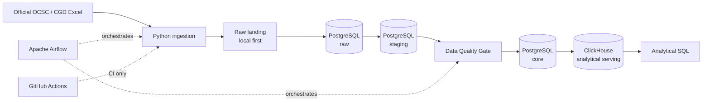

# Thai Public Data Platform

ผลงาน portfolio สำหรับตำแหน่ง **Data Engineer — Siam Codex**

โปรเจกต์นี้ออกแบบให้เปลี่ยนรายงาน Excel สาธารณะจากสำนักงาน ก.พ. (OCSC) และกรมบัญชีกลาง (CGD) ให้เป็น data platform ที่มี lineage, idempotency, data-quality gate และ analytical serving layer ชัดเจน โดยใช้ PostgreSQL เป็น relational source of truth และ ClickHouse เป็นชั้นสำหรับการอ่านเชิงวิเคราะห์

> สถานะปัจจุบัน: **P0 implementation complete** — local parser/DQ tests ผ่านแล้ว และ Docker/CLI/Airflow runtime integration verified แล้ว

## เป้าหมายของผลงาน

ผลงานชิ้นนี้ตั้งใจให้ reviewer เห็นความสามารถด้าน Data Engineering ที่สำคัญในหนึ่ง repository:

- อ่านและ normalize Excel report ที่มี merged cells, multi-row headers, formula และ total/subtotal
- เก็บ raw evidence ระดับไฟล์, sheet และ cell เพื่อ trace กลับต้นทางได้
- ออกแบบ PostgreSQL schemas เป็น `raw → staging → core` พร้อม primary key, foreign key, unique grain และ check constraints
- ทำ pipeline ให้รันซ้ำได้โดยใช้ SHA-256 ของ source release เป็น source identity
- บันทึก pipeline run และผลตรวจคุณภาพใน `ops`
- ส่ง downstream publishing หยุดแบบ fail-closed เมื่อ quality gate ไม่ผ่าน
- ส่งเฉพาะข้อมูลที่ผ่าน gate ไป ClickHouse สำหรับ analytical SQL
- ใช้ Airflow เป็น orchestration layer ที่บางและอ่านง่าย โดย business logic อยู่ใน `src/`

## Locked architecture



กติกาที่ล็อกไว้:

| ส่วน | หน้าที่ | สิ่งที่ไม่ทำ |
|---|---|---|
| Python | ingestion, parsing, transform, validation และ load orchestration adapter | ไม่ฝัง business logic ใน DAG |
| Local raw landing | รับไฟล์ต้นทางก่อนเข้า database | ไม่ถือเป็น warehouse of record |
| PostgreSQL | canonical relational truth: `raw`, `staging`, `core`, `ops` | ไม่ใช้ DuckDB เป็น architecture หลัก |
| Data Quality Gate | ตรวจข้อมูลก่อน publish | ไม่ปล่อย partial downstream publish |
| ClickHouse | analytical serving/read model | ไม่ใช้เป็น source of truth |
| Airflow | schedule, dependency, retry, run context | ไม่ใส่ parser หรือ SQL business rules ใน DAG |
| GitHub Actions | lint และ test CI | ไม่ทำ orchestration รายเดือน |
| GCS | optional raw landing หลัง P0 green | ไม่เริ่มในวันแรก |

## Baseline ที่ตรวจสอบแล้ว

ไฟล์ baseline เป็น public releases ที่เก็บไว้เพื่อให้ local demo ทำซ้ำได้ และมี hash, reporting period และ source page กำกับไว้ใน [`config/source_manifest.json`](config/source_manifest.json)

| Dataset | ไฟล์ | Sheets | Non-empty cells | Formula cells | Parsed rows | Reporting period |
|---|---|---:|---:|---:|---:|---|
| OCSC government manpower | `datasets/ocsc/thai-gov-manpower-2567.4.xlsx` | 68 | 32,653 | 261 | 5,784 | FY 2567 / 2024 |
| CGD budget execution | `datasets/cgd/2026.07.03.xlsx` | 15 | 93,237 | 19 | 2,937 | as of 3 Jul 2569 / 2026 |
| รวม | 2 files | 83 | 125,890 | 280 | 8,721 | คนละ reporting period |

ข้อควรระวังสำคัญ: OCSC baseline และ CGD baseline เป็นคนละช่วงเวลา จึงห้ามตีความ join หรือ ratio ระหว่างสองแหล่งเป็นความสัมพันธ์เชิงเวลาโดยอัตโนมัติ

## Airflow DAG contract

DAG contract ใน [`dags/README.md`](dags/README.md) มี task IDs ดังนี้:

```text
prepare_run
    ↓
┌────────────┐
ingest_cgd   ingest_ocsc
└──────┬─────┘
       ↓
validate_staging
       ↓
publish_core
       ↓
quality_gate
       ↓
publish_clickhouse
       ↓
analytics_smoke
```

Executable DAG, PostgreSQL DDL/loader และ ClickHouse publisher อยู่ใน repository แล้ว; คำสั่งรันจริงอยู่ในหัวข้อ Local runbook ด้านล่าง

## Data-quality contract

Quality gate ต้องครอบคลุมอย่างน้อย:

- required keys และ required source metadata
- zero-row extraction
- duplicate natural grain
- negative financial values
- percentage bounds `0–100` for rates; signed monthly target variance bounds `-100–100`
- reconciliation ระหว่าง detail กับ published total เมื่อ semantic grain เปรียบเทียบได้
- foreign-key integrity
- unexpected row-count collapse เทียบกับ baseline/previous successful run

ไฟล์ [`tests/fixtures/bad_data_quality.json`](tests/fixtures/bad_data_quality.json) เป็น bad-data contract สำหรับพิสูจน์ว่า gate ต้องหยุด `publish_core`/`publish_clickhouse` เมื่อข้อมูลผิด

## Analytical questions

มี SQL สำหรับตอบคำถามต่อไปนี้:

1. หน่วยงานหรือหมวดใดมี budget allocation สูงสุด
2. หน่วยงานใดมี disbursement ต่ำกว่าค่ามัธยฐานของกลุ่มที่เทียบกันได้
3. การกระจาย workforce ตาม ministry, entity type และ metric group เป็นอย่างไร
4. budget-to-workforce ratio ของหน่วยงานที่ match กันได้เป็นอย่างไร

ทุก query ต้องกรอง `report_type`, `expense_category`, `entity_type`, metric และ reporting period ให้ตรง grain ก่อน aggregate

## Repository map

```text
.
├── .github/workflows/          # CI only
├── analytics/queries/          # analyst-facing SQL and serving smoke checks
├── config/                     # public source registry and baseline manifest
├── dags/                       # Airflow contract; orchestration only
├── datasets/                   # public baseline Excel files
├── docs/                       # charter, design, decisions and validation evidence
├── scripts/                    # explicit operational helpers (no secrets)
├── sql/clickhouse/             # analytical serving DDL
├── sql/postgres/               # raw/staging/core/ops migrations
├── src/thai_data_platform/     # ingestion, transform, storage, warehouse, quality
└── tests/                      # unit, integration and fixtures
```

## Validation & local runbook

คำสั่งตรวจคุณภาพ:

```powershell
python -m pip install -e ".[dev]"
python -m pytest
python -m ruff check .
python -m thai_data_platform profile --ocsc datasets/ocsc/thai-gov-manpower-2567.4.xlsx --cgd datasets/cgd/2026.07.03.xlsx
python -m thai_data_platform quality-fixture  # expected exit code 1: gate must block
docker compose config
```

`quality-fixture` ต้องคืน exit code `1` เพราะเป็น fixture ที่ตั้งใจเสียเพื่อพิสูจน์ fail-closed behavior

### Run the local stack

1. สร้าง `.env` จาก [`.env.example`](.env.example) แล้วเปลี่ยนค่ารหัสผ่านเฉพาะในเครื่อง (ถ้ามี `.env` อยู่แล้วให้เก็บค่าเดิมไว้):

```powershell
if (-not (Test-Path .env)) { Copy-Item .env.example .env }
```

ถ้าเครื่องมี PostgreSQL อื่นใช้ port `5432` อยู่ ให้ตั้ง `POSTGRES_PORT=55432` ใน `.env` และใช้ port เดียวกันใน connection string; การใช้ `127.0.0.1` ช่วยหลีกเลี่ยงความหน่วงจาก IPv6/`localhost` บน Windows

2. เริ่ม stack ทั้งชุด (รวม migration ของ Airflow และ service dependencies):

```powershell
docker compose up -d --build
docker compose ps
```

ควรเห็น PostgreSQL และ ClickHouse เป็น `healthy`, Airflow scheduler/webserver เป็น `Up` และ webserver เปิดที่ `http://127.0.0.1:8080`

3. ตั้งค่า connection string ใน PowerShell session เดียวกัน โดยใช้ password และ port เดียวกับ `.env`:

```powershell
$env:POSTGRES_URL = "postgresql://platform:<POSTGRES_PASSWORD>@127.0.0.1:<POSTGRES_PORT>/thai_data_platform"
$env:CLICKHOUSE_PASSWORD = "<CLICKHOUSE_PASSWORD>"
```

4. ตรวจ workbook profile และ apply migrations (ถ้า `airflow-init` เพิ่งทำไปแล้ว คำสั่งนี้เป็นการตรวจซ้ำแบบปลอดภัย):

```powershell
python -m thai_data_platform profile `
  --ocsc datasets/ocsc/thai-gov-manpower-2567.4.xlsx `
  --cgd datasets/cgd/2026.07.03.xlsx
python -m thai_data_platform migrate --postgres-url $env:POSTGRES_URL
```

5. รัน full path จาก Excel → PostgreSQL → DQ gate → ClickHouse:

```powershell
python -m thai_data_platform run `
  --ocsc datasets/ocsc/thai-gov-manpower-2567.4.xlsx `
  --cgd datasets/cgd/2026.07.03.xlsx `
  --postgres-url $env:POSTGRES_URL `
  --clickhouse-host 127.0.0.1 `
  --clickhouse-port 8123 `
  --clickhouse-password $env:CLICKHOUSE_PASSWORD
```

การรันซ้ำด้วยไฟล์เดิมใช้ SHA-256 และ unique grain เดิม จึงไม่สร้าง source/staging/core/serving rows ซ้ำ

### Run Airflow

Airflow ใช้ image ที่ติดตั้ง package นี้แล้วและ mount DAG, source, migrations, queries และ runtime data ไว้ครบ:

```powershell
docker compose ps
docker exec thai-public-data-platform-airflow-scheduler-1 airflow dags unpause thai_public_data_platform
docker exec thai-public-data-platform-airflow-scheduler-1 airflow dags trigger thai_public_data_platform --run-id manual_local_test
```

เปิด `http://127.0.0.1:8080` แล้วติดตาม DAG `thai_public_data_platform` แบบ manual ได้ โดยใช้ credentials จาก `.env`; default schedule เป็น `None` และ timezone ของ DAG เป็น Asia/Bangkok รายละเอียดคำสั่งตรวจ task, row counts, positive/negative test และ cleanup อยู่ใน [`docs/DOCKER_TEST_RUNBOOK.md`](docs/DOCKER_TEST_RUNBOOK.md)

## Scope boundary ของวันแรก

### P0

Python, PostgreSQL, Docker, Airflow, idempotency, data quality, analytical SQL, ClickHouse, tests และ README

### Optional หลัง core green

GCS สำหรับ raw landing

### ยังไม่เริ่ม

Kafka, Spark, Kubernetes, Terraform, frontend, ML, LLM และ dashboard ที่ไม่จำเป็นต่อ proof of engineering

## Security baseline

- ไม่ commit `.env`, service-account JSON, credentials, private key หรือ generated database files
- ใช้ค่าตัวอย่างที่ปลอดภัยและไม่ใช่ secret จริงใน [`.env.example`](.env.example) เท่านั้น
- bind development services กับ `127.0.0.1` ใน Compose
- ตรวจ source snapshot และไฟล์ที่สร้างด้วย high-confidence secret scan ก่อนส่งมอบ

รายละเอียด data provenance และวิธีทำให้ baseline reproducible อยู่ที่ [`docs/PROVENANCE.md`](docs/PROVENANCE.md)
